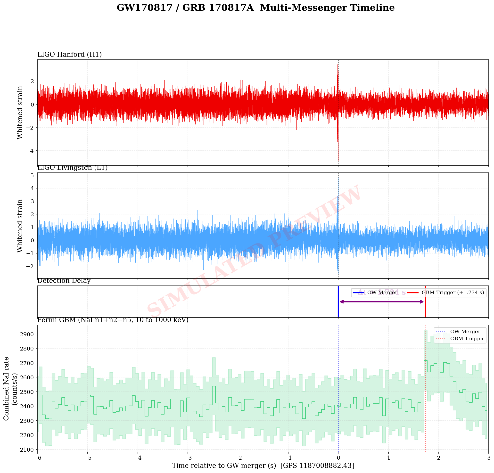
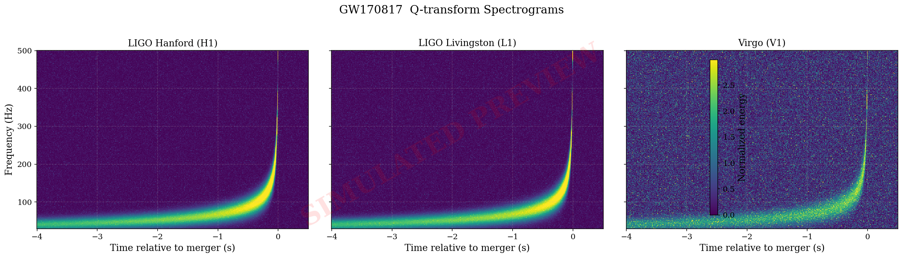
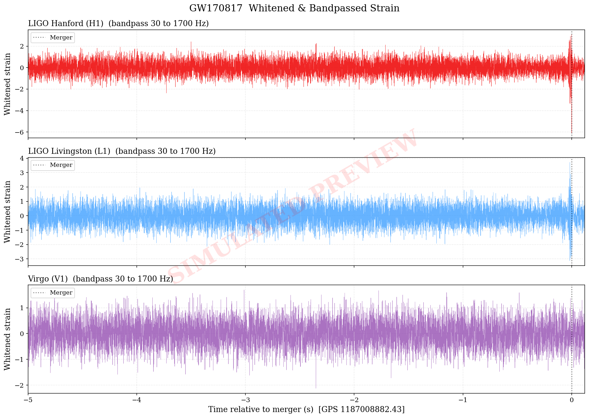
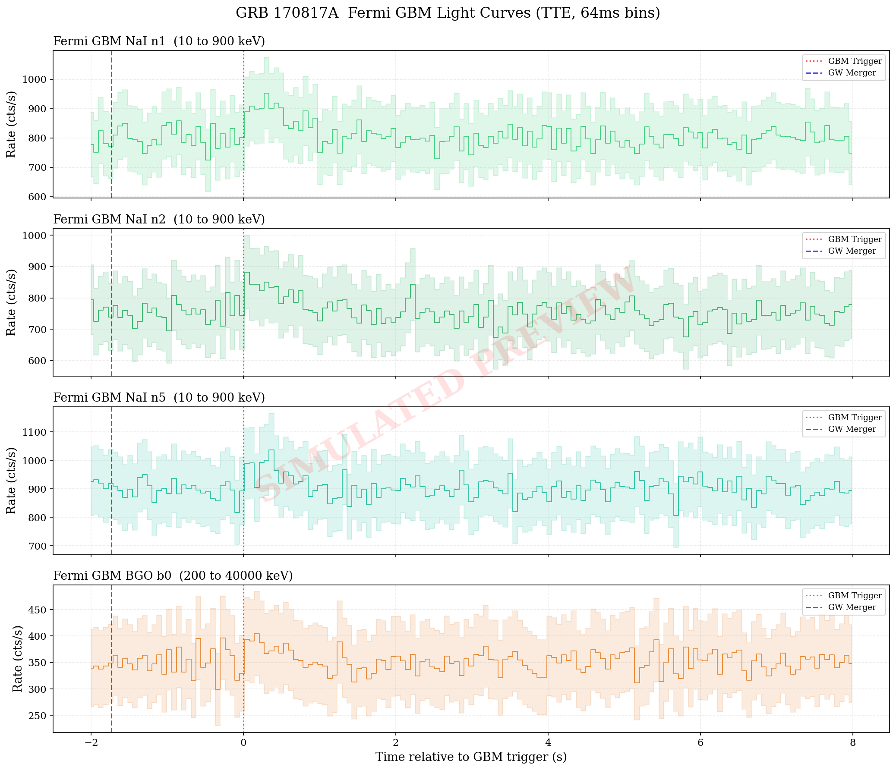
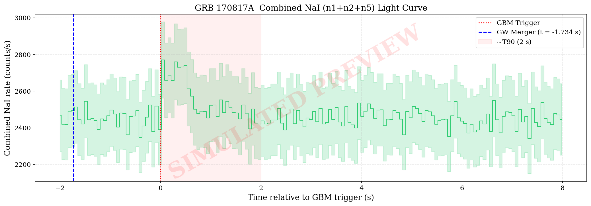
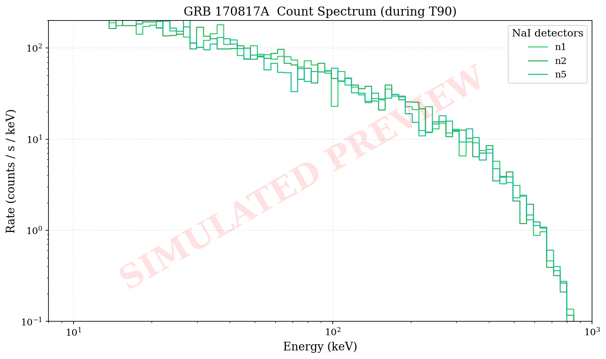
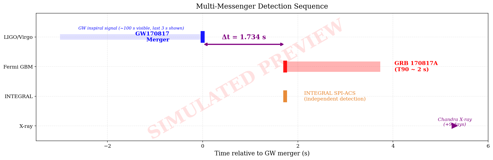
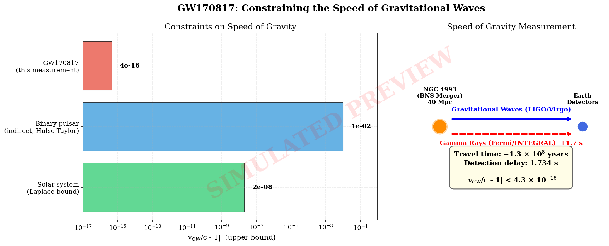

# GW170817 / GRB 170817A Multi-Messenger Analysis

A complete Python analysis pipeline for the first joint gravitational wave and
electromagnetic counterpart detection: the binary neutron star merger GW170817
and its associated short gamma-ray burst GRB 170817A.

## Overview

On August 17, 2017, LIGO and Virgo detected gravitational waves from a binary
neutron star merger (GW170817). Approximately 1.7 seconds later, Fermi GBM and
INTEGRAL independently detected a short gamma-ray burst (GRB 170817A) from the
same source in NGC 4993 at ~40 Mpc. This event marked the dawn of
multi-messenger astronomy with gravitational waves.

This pipeline reproduces the core observational analysis and comparison between
the GW and EM signals.

## Project Structure

```
gw170817_multimessenger/
├── README.md
├── requirements.txt
├── src/
│   ├── config.py              # Event parameters, detector info, analysis settings
│   ├── gw_analysis.py         # GW strain: download, process, visualize
│   ├── grb_analysis.py        # Fermi GBM: download, light curves, spectra
│   ├── comparison.py          # Multi-messenger timing and property comparison
│   ├── main.py                # Entry point for the full pipeline
│   └── generate_previews.py   # Generate the preview plots shown below
└── docs/
    └── preview_plots/         # Simulated preview images (shown below)
```

## Quick Start

```bash
# 1. Create a virtual environment (recommended)
python -m venv venv
source venv/bin/activate

# 2. Install dependencies
pip install -r requirements.txt

# 3. Run the full pipeline
cd src
python main.py

# Or run individual modules:
python main.py --gw-only      # Only gravitational wave analysis
python main.py --grb-only     # Only Fermi GBM analysis
python main.py --compare      # Only comparison plots (schematic, no data needed)
python main.py --no-show      # Save plots without displaying
```

## Output Preview

> **Note:** The plots below are generated from **simulated data** to illustrate the
> expected output format of the pipeline. They are produced by
> `src/generate_previews.py` and are included here for illustration only.
> Run the real pipeline (`python main.py`) to produce plots from actual
> LIGO/Virgo and Fermi GBM observations.

### Multi-Messenger Timeline (Key Figure)

The central figure of the analysis: GW inspiral strain from LIGO on top, the
detection delay annotation in the middle, and the Fermi GBM gamma-ray light
curve on the bottom, all sharing the same time axis centered on the GW merger.



### Gravitational Wave Analysis

**Q-transform Spectrograms** show the characteristic BNS inspiral chirp in the
time-frequency plane. The signal sweeps upward from ~50 Hz to several hundred Hz
as the neutron stars spiral closer. H1 and L1 show strong tracks, while V1 is
much fainter due to the source sky position relative to the detector antenna
pattern.



**Whitened and Bandpassed Strain** in the time domain. The chirp amplitude
increases rapidly in the final moments before merger. LIGO Hanford (H1) and
Livingston (L1) clearly detect the signal, while Virgo (V1) contributes mainly
to sky localization rather than detection SNR.



### Gamma-Ray Burst Analysis (Fermi GBM)

**Individual Detector Light Curves** from the three most illuminated NaI
detectors (n1, n2, n5) and one BGO detector (b0). Each panel shows the count
rate vs time relative to the GBM trigger, with error bands. The dashed blue line
marks the GW merger time (1.734 s before the GBM trigger).



**Combined NaI Light Curve** sums the three brightest NaI detectors to improve
the signal to noise ratio. The shaded red region marks the approximate T90
duration (~2 s). GRB 170817A was unusually faint compared to typical short GRBs,
consistent with an off-axis jet viewing geometry.



**Count Spectrum** shows the photon energy distribution during the burst
interval (T90), plotted for each NaI detector on a log-log scale.



### Multi-Messenger Comparison

**Detection Sequence Diagram** showing the chronological order of detections
across different instruments and wavelengths, with the 1.734 s delay between GW
merger and GBM trigger clearly annotated.



**Speed of Gravity Constraint** derived from the 1.734 s delay over ~130 million
light-years of travel. The left panel compares this measurement to previous
bounds on a logarithmic scale. The right panel illustrates the measurement
schematically.



## Data Sources

| Source | Description | Access |
|--------|-------------|--------|
| GWOSC | GW strain data (GWTC-1, O2 run) | [gwosc.org](https://gwosc.org) |
| Fermi GBM | Gamma-ray trigger bn170817529 | [HEASARC](https://heasarc.gsfc.nasa.gov) |
| LIGO DCC | LALInference sky map | [dcc.ligo.org](https://dcc.ligo.org) |

All data is downloaded automatically on first run and cached locally.

## Key Results Reproduced

| Quantity | Value |
|----------|-------|
| Detection delay (GRB after GW) | ~1.734 seconds |
| Speed of gravity constraint | \|v_GW/c - 1\| < ~10^-15 |
| GW sky localization (90% region) | ~28 sq deg |
| GRB isotropic energy | ~3 x 10^46 erg (unusually faint) |
| Network SNR | 32.4 |
| Distance | ~40 Mpc (NGC 4993) |

## References

1. Abbott et al. 2017, PRL 119, 161101 (GW170817 discovery)
2. Goldstein et al. 2017, ApJL 848, L14 (Fermi GBM detection)
3. Savchenko et al. 2017, ApJL 848, L15 (INTEGRAL detection)
4. Abbott et al. 2017, ApJL 848, L13 (GW+EM counterpart)
5. Troja et al. 2017, Nature 551, 71 (X-ray counterpart)

## Extending This Analysis

This pipeline is designed as a reusable template. To adapt it for future
multi-messenger events (O4/O5 BNS or NSBH mergers with EM counterparts):

1. Update `config.py` with new event parameters (GPS time, sky position, masses)
2. Modify data fetching functions for the relevant catalogs and triggers
3. Adjust energy ranges and time windows to match the new event
4. Add new comparison metrics as needed

## License

This project is provided as an educational and research template.
